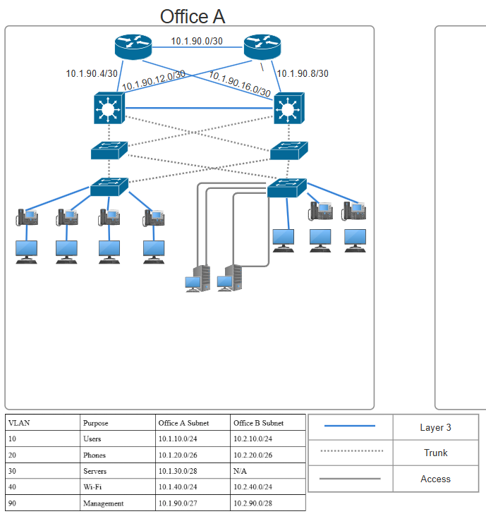

## Network & VLANs

| VLAN | Purpose   | Office A Subnet |
|------|-----------|-----------------|
| 10   | Users     | 10.1.10.0/24    |
| 20   | Phones    | 10.1.20.0/26    |
| 30   | Servers   | 10.1.30.0/28    |
| 40   | Wi-Fi     | 10.1.40.0/24    |
| 90   | Management| 10.1.90.0/27    |

My thought process here is that using a 10.0.0.0/8 network allows me to easily separate the two offices at the second octet. This will make summarization for ACLs/routing a lot easier, as Office A is in 10.1.0.0/16 and Office B is in 10.2.0.0/16.
Variable Length Subnet Masking (VLSM) was used to appropriately size the subnets while still allowing room for growth. The “Management” VLAN in Office B is smaller than in Office A, as it is a smaller branch office and deploys less infrastructure

## Initial Network Planning

The diagram above shows my initial topology for Office A. My primary goal is creating redundancy while maximizing throughput. Each Access Switch trunks to each Distribution Switch, which then trunks to each Core Switch. The Core Switches would then perform inter-VLAN routing and HSRP for redundancy. While designing this architecture, I noticed the Distribution Switches added increased Spanning Tree and routing complexity while performing no beneficial role in the network. With the Core Switches handling inter-VLAN routing and HSRP, the Distribution Switches are only acting as a relay with no Layer 3 or policy functionality in this design. This results in all Layer 3 networking being done at the Core Layer, leaving the Distribution Layer underutilized.

While larger enterprises may benefit from this “Three-Tier” network architecture design, the offices being simulated in this lab would better benefit from a “Collapsed Core” design. In this design, the Distribution and Core Layers are collapsed into one “Collapsed Core”, reducing complexity. After evaluating the needs of each office which serve no more than 100 users each, I made the architectural decision to convert to a “Collapsed Core” design.

