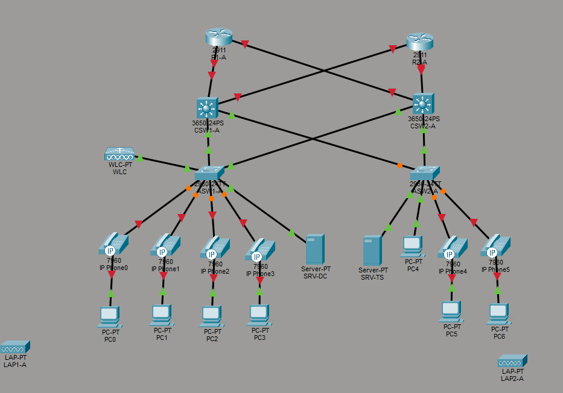

## Initial Deployment Into Packet Tracer



This initial deployment phase involves recreating the diagram in Packet Tracer. I decided to use the Cisco 2911 Router, 3560-24PS Multilayer Switch, and 2960-24TT Switch. These devices are capable of performing all of the functions necessary in the lab, including OSPF, HSRP, and STP.

A few things I noticed while deploying this lab in Packet Tracer:
* The servers currently only have one NIC available. I will have to look into options for enabling LACP with dual-NIC.
* CSW1's local interface connected to the WLC is a FastEthernet Port, while the WLC's local interface is a GigabitEthernet Port. If there are any issues, I will have to look into ensuring the link speeds match.
* The Core Switches were not able to be turned on without manually adding **Power Supply Modules** into the "Physical" tab of the switch. I did not know Packet Tracer had in-depth physical modules and would definitely like to look into it more.

Next Steps:
* Creating secure, privileged accounts.
* Ensuring Switches follow security best practice (enabling SSH only, strong password).

## Device Hardening

Right after the network devices are deployed, it is best practice to create a security baseline. A malicious actor could easily exploit a poorly configured network device, so it's best to prioritize the security over the initial network setup.

Since I am configuring several network devices with the same settings, I decided to create a baseline security config in a notepad, which I could then paste into each device's CLI. The security config is as follows:
````
ip domain-name Lab.local
crypto key generate rsa
2048
ip ssh version 2
!
username labadmin privilege 15 secret Lab321
enable secret LabLogin
service password-encryption
login block-for 120 attempts 3 within 60
!
line con 0
login local
exec-timeout 10
!
line vty 0 15
login local
exec-timeout 5
transport input ssh
````
* The **first** set of commands creates a domain name and enables SSH. It is important to choose a strong key with at least 2048 bits and also enable SSH version 2 for stronger encryption.
* The **second** set of commands sets Secrets for both entering "Privileged Exec" mode and for logging into the "labadmin" user, which has Privilege 15 (Highest permissions). It also stores all clear-text passwords as Type 7 using the "service password-encryption" command. Type 7 encryption is not strong but it is used to prevent clear-text passwords being shown in the running config.
* The **third** set of commands enables local logins on the console line and sets a 10-minute timeout for the console. Since it is extremely rare for the console to be exploited by a malicious actor as they would need physical access to the device, a longer exec-timeout is fine.
* Finally, the **fourth** set of commands configures the terminal lines. It enables local logins, sets a shorter 5-minute timeout, and forces SSH to be used. This is best practice as Telnet is unencrypted and a vulnerability.

* In the future, an ACL will be applied to the vty lines.

Next Steps:
* Configure VLANs on all switches.
* Ensure Rapid-PVST+ is enabled and Spanning Tree is configured correctly. Manipulate Root Bridges and enable PortFast/BPDU Guard.
* Configure Access Switches with downstream Access Ports and upstream Trunk Ports. Apply appropriate VLANs to ports.

## VLAN Configuration

The initial step in this section is creating the appropriate VLANs on each switch. While a VTP Server can be used to propagate the VLANs to each VTP Client switch, after doing further research I came to the conclusion that using VTP is not best practice. VTP Servers can create a single point of failure, causing a configuration issue on the VTP Server to affect every client. Furthermore, if a new switch were to be introduced and take over as VTP Root, it could permanently wipe out the VLAN database of every other switch. While this lab is a small simulation and such an issue occurring would cause minimal downtime, I decided to follow best practice for larger enterprise networks. In a larger more sophisticated network, a configuration pushing tool such as Ansible would be used but due to Packet Tracer limitations and Ansible falling outside of the scope of this lab, I decided to simply type the commands into a notepad and paste them into each individual switch.
```
vlan 10
name Users
!
vlan 20
name Phones
!
vlan 30
name Servers
!
vlan 40
name Wi-Fi
!
vlan 90
name Management
```
* The set of commands above create the appropriate VLANs on each device.

* While working on deploying these commands, I had to log back into the switches. I noted that while logging into the "labadmin" user on the Core Switches allowed me to access Privileged Exec without a password, the Access Switches required me to input the Enable secret.
* I further investigated this issue by running ```sh run | inc labadmin``` on CSW1-A and then on ASW1-A.
  * On CSW1-A, I got the following output: ```username labadmin privilege 15 secret 5 $1$mERr$JAbIelvRLsDmA1aIeBB3T/```
  * On ASW1-A, I got the following output: ```username labadmin secret 5 $1$mERr$JAbIelvRLsDmA1aIeBB3T/```
* On ASW1, I removed labadmin and recreated it, making sure to include "privilege 15", yet I got the same result.
* After doing research, this seems to be another Packet Tracer limitation for the 2960-24TT switches. In a live environment, this account would have the appropriate privilege level.
* Just to confirm this, I created a new 2960 Switch with the base config and tried running ```username labadmin privilege 15 secret Lab321```. Same result. I decided to chalk this to Packet Tracer simulation issues and continued on.

Next Steps:
* Configure Access Switch edge ports
* Configure Spanning Tree

## Layer 2 Trunk and Edge Port Configurations

Afterwards, I wanted to configure the edge ports first as they are the most susceptible to physical access vulnerability. As they are edge ports, I plan on enabling PortFast to allow immediate network access to end devices. I also plan on enabling BPDU Guard, Port Security, and DHCP Snooping for a stronger Access Layer security posture.

Before the security commands, I of course had to first properly configure the edge ports as Access Ports with the appropriate VLANs. The ports connection to VOIP phones would require both VLANs 10 and 20, while the servers would require VLAN 30. As the process is quite similar for each edge port, I will provide an example of configuring the ports connecting to a VOIP phone on ASW1-A.
```
Interface-Range f0/2-5
switchport mode access
switchport access vlan 10
switchport voice vlan 20
switchport nonegotiate
!
switchport port-security
switchport port-security maximum 2
switchport port-security violation restrict
!
spanning-tree portfast
spanning-tree bpduguard enable
```
* In the case of ports connecting to a VOIP phone, the port-security maximum is set to "2". This is due to both the PC and VOIP phone having their own MAC Address.
* Furthermore, I used ```switchport nonegotiate``` to disable Dynamic Trunking Protocol (DTP). This is a security best practice to ensure the port can't be manipulated to participate in trunk negotiation

After configuring each switches edge ports, I realized I forgot to configure ASW1-A's port to the WLC. Since the wireless network is Split-MAC, all data received by the AP's will be sent through the LAN to the WLC via an encrypted CAPWAP tunnel. Therefore, I configured this port as a trunk port allowing both VLAN 40 (Wi-Fi) and VLAN 90 (Management). I also made sure to use the special command ```spanning-tree portfast trunk```, as trunk ports require extra confirmation to confirm enabling PortFast.

Following the WLC port configuration, I realized I kept the default VLAN "1" on all of the ports. This is not considered best practice as it leaves ports vulnerable to rogue switches, enabling attacks such as VLAN Hopping. I fixed this by changing the default VLAN on all switches to 300.

Finally, I configured the Access Switches' upstream ports to the Core Switches as trunk ports carrying all VLANs. Since these are not edge ports, there is no need for port-security, portfast, or BPDU guard. To prevent the native VLAN errors and since this section is covering all Layer 2 interfaces, I decided to also configure the Core Switch downstream trunk ports to the Access Switches. HSRP and Trunking between the Core Switches will be configured in a later section.

## Spanning Tree and VLAN Gateway HSRP Configuration

The initial step in this section is confirming each switch has RPVST+ enabled. Usually PVST is enabled by default, which I was able to confirm with a quick ```Show Spanning-Tree Summary``` command. To change this to RPVST+, I issued the ```Spanning-Tree Mode Rapid-PVST``` on each switch.

Afterwards, I focused on configuring HSRP for VLAN default gateway redundancy between the two core switches. To do this, I first had to bundle the ports connecting each switch using link aggregation. As these are Cisco devices, I decided to go with PAgP and configured the port-channels for each switch using the following commands.
```
interface-range g1/0/10-11
channel-protocol pagp
channel-group 1 mode desirable
!
interface port-channel 1
switchport mode trunk
switchport trunk allowed vlan 10,20,30,40,90
switchport trunk native vlan 300
```
* The above commands configure ports g1/0/10 and g1/0/11, which are each switch's ports connecting to the neighbor core switch, for the PaGP EtherChannel Protocol. It then creates a Port-Channel interface and configures this new interface as a trunk.
* EtherChannel is extremely useful in Spanning Tree environments, as it allows redundant ports to operate as backups while still allowing maximum throughput.

Afterwards, I needed to configure HSRP between the two switches. HSRP will allow each switch to be the default gateway for certain VLANs while acting as the backup gateway for other VLANs. This allows resilience and load-balancing on all VLAN traffic. Since there are 5 VLANs, one switch will need to be the default gateway for three. I decided to make this switch CSW1-A, which will take the "Management" VLAN also.

The HSRP commands are quite repetitive, so the below section will simply provide an example of setting CSW1-A as the "Active" router for VLAN 90 and CSW2-A as the "Standby" router.
```
// CSW1-A
ip routing // Enables Layer 3 Routing
interface vlan 90
ip address 10.1.90.2 255.255.255.224
!
standby 1 ip 10.1.90.1
standby 1 priority 105
standby 1 preempt
!
// CSW2-A
ip routing
interface vlan 90
ip addr 10.1.90.3 255.255.255.224
!
standby 1 ip 10.1.90.1
```

* The ```priority``` and ```preempt``` commands on CSW1-A are used to manipulate the "Active" router, ensuring CSW1-A is selected as the Active and returns to its role after any HSRP refreshes.

Of course, Spanning Tree Root Selection must align with HSRP Default Routers to create an efficient traffic flow. To do this, I configured each Core Switch to be the Spanning Tree Root for each VLAN they're the Active Router for. For VLANs they are the Standby Router for, I configured them to operate as a Spanning Tree Root Secondary. Below is an example of the commands being performed for VLAN 90.
```
// CSW1-A
spanning-tree vlan 90 root primary
!
// CSW2-A
spanning-tree vlan 90 root secondary
```


| VLAN | STP Root (Primary) | STP Secondary | HSRP Active | HSRP Standby |
|------|-------------------|---------------|-------------|--------------|
| 10   | CSW1-A            | CSW2-A        | CSW1-A      | CSW2-A       |
| 20   | CSW1-A            | CSW2-A        | CSW1-A      | CSW2-A       |
| 30   | CSW2-A            | CSW1-A        | CSW2-A      | CSW1-A       |
| 40   | CSW2-A            | CSW1-A        | CSW2-A      | CSW1-A       |
| 90   | CSW1-A            | CSW2-A        | CSW1-A      | CSW2-A       |

* Confirmed HSRP alignment using ```show standby brief```


  
